# DSA Survey Strategy Comparison

Simulated comparison of two survey strategies for single-dish 21cm observations
with the Deep Synoptic Array (DSA), located at
(lat = 39.5540°, lon = -114.4240°, h = 1746.51 m).

## Motivation

There is a tension between DSA's planned continuum survey (stop-and-stare
pointings for imaging) and what works best for 21cm intensity mapping
(constant-elevation azimuthal scans, as used by MeerKLASS). These notebooks
simulate both strategies targeting the same sky patch with comparable
integration time, so map-making performance can be compared directly.

## Two Survey Strategies

### 1. Azimuthal scan (constant-elevation)

North-facing scan at **el = 55°** (zenith angle 35°), with back-and-forth
azimuthal sweeps that let the sky drift through the beam between sweeps.
Two crossing scans (setting + rising) at mirrored azimuths give different
parallactic angles on the same Dec strip:

- Setting: az = -60.3°…-42.3° (west of north, source past transit)
- Rising:  az = +42.3°…+60.3° (east of north, source before transit)
- Coverage: RA ≈ 168°–193°, Dec ≈ 48°–58°  (~10° Dec strip)
- 5720 samples, 191 min

The relatively high elevation (vs. the wider el = 45° MeerKAT-style scan)
trades sky area for deeper integration per beam — appropriate for an IM
survey targeting cosmological scales rather than maximal sky coverage.

### 2. Stop-and-stare (steering-and-shift)

Track a fixed (RA, Dec) for 21 min, then slew to the next overlapping
position. 3×3 hexagonal grid centered on (RA = 180°, Dec = 52°), inspired by
the DSA CASS survey design ([DSA-00264](./DSA-00264-SYS-DES_Survey_Design.pdf))
and the uGMRT flower pattern ([arXiv:2510.09571](./2510.09571v1.pdf)).

- 9 pointings, spacing 3.5° → 28% beam-FWHM overlap between neighbours
- During each pointing both Az and El vary as the source tracks across the
  local sky; `elevation_deg` is passed to `TODSim.generate_TOD` as a
  **per-sample array** (rather than a scalar)
- 9 × 21 min = 189 min (5670 samples)

3×3 hexagonal pointing grid with 28% beam-FWHM overlap between neighbours;
within each 21-minute pointing both Az and El drift as the source tracks
across the local sky:

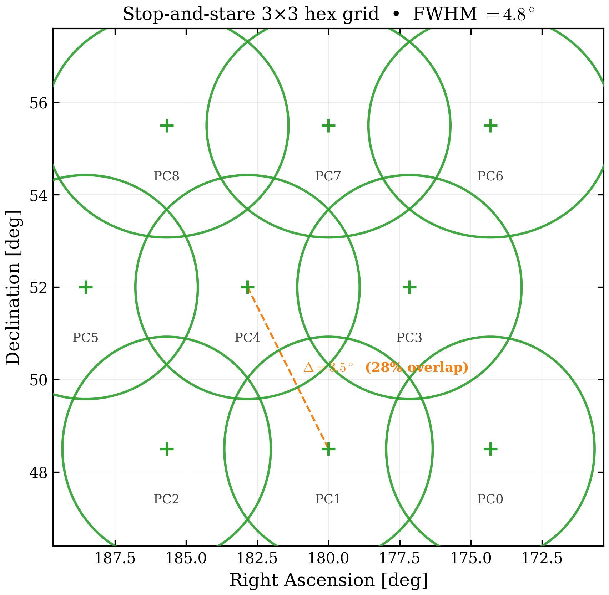
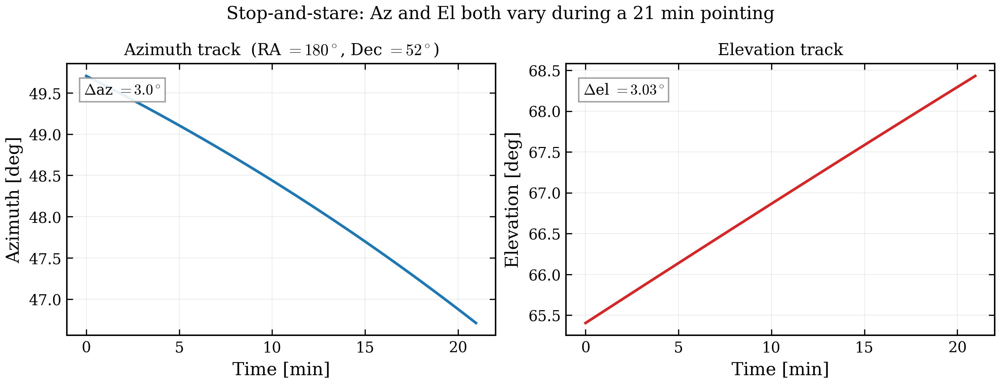

Both strategies target the same patch with comparable integration time:

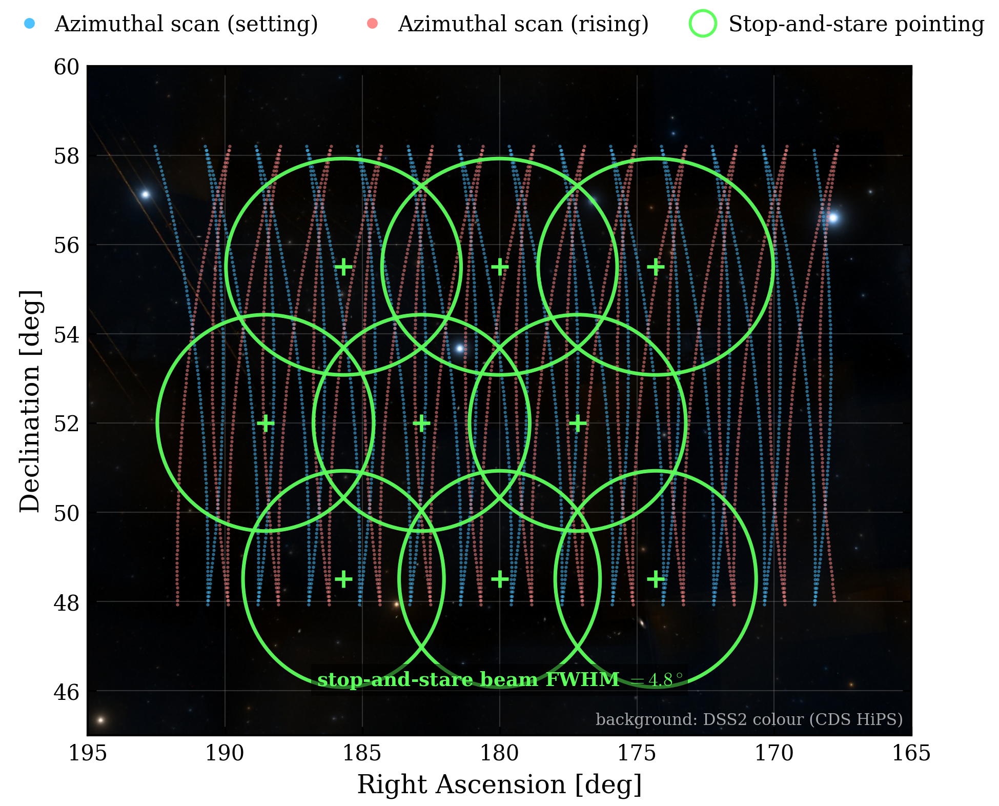

## Beam

The DSA zenith far-field beam ([beam_map_zenith.fits](./beam_map_zenith.fits))
is a HEALPix nside = 128 map with FWHM ≈ 4.5° and integrated solid angle
Ω_beam ≈ 28 deg² at 1 GHz. The first sidelobe sits ~30 dB below the peak
at ~6° from the boresight.

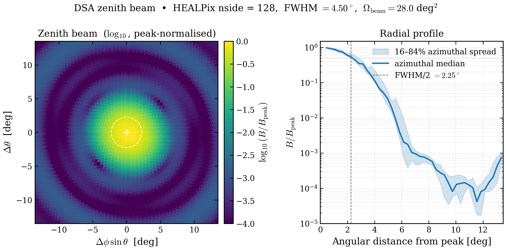

Left: log-scale beam pattern around the peak (colour scale doubles as a
dB-below-peak reading). Right: azimuthal-median radial profile, with the
shaded band showing the 16–84% spread across azimuth — a measure of the
beam's residual asymmetry. The dashed line marks FWHM/2.

## Simulation and Map-Making

Both notebooks follow the pattern of [mm_example.ipynb](../mm_example.ipynb):

1. **Beam**: the zenith far-field beam is loaded from
   [beam_map_zenith.fits](./beam_map_zenith.fits) (HEALPix nside = 128,
   FWHM ≈ 4.5°), normalised to sum = 1 and passed to
   `TODSim(beam_func=dsa_beam_func, beam_nside=128, ...)`.
2. **Sky**: `GDSM_sky_model` at 1000 MHz, nside = 64.
3. **TOD generation** via `TODSim.generate_TOD(...)`:
   beam-rotated sky convolution + default 1/f gain noise +
   white noise variance = 2.5 × 10⁻⁶ (fractional).
4. **Map-making** via `HPW_mapmaking` — a **deliberately simple
   high-pass + Wiener-filter pipeline** (not joint Gibbs sampling):
   the TOD is Butterworth high-pass-filtered (order 4, cutoff 0.001 Hz)
   to knock down 1/f drift, then a per-pixel Wiener filter solves
   `(AᵀN⁻¹A + S⁻¹ + λI)·x = AᵀN⁻¹·d + S⁻¹·μ` with configurable prior
   and noise covariance. This is the "first-pass" map-maker described
   in Zhang et al. 2026 ([arXiv:2509.10992][zhang26]) §II; it is *not*
   the full joint Bayesian calibration + map-making solver proposed
   there, only the fast linear stage. All the scan-strategy differences
   we report below are therefore conservative — a full joint solver
   would recover more structure, especially on sub-beam scales.

[zhang26]: https://arxiv.org/abs/2509.10992

## Focused comparison (ns=64, HP filter on)

Three configurations × two prior treatments (six panels total). All
recoveries use the same **simple high-pass + Wiener-filter map-maker**
(Zhang et al. 2026, [arXiv:2509.10992][zhang26], §II — *not* the full
joint Bayesian solver), same patch, same noise budget
(`WHITE_VAR=1e-7`, `GAIN_F0=1.335e-7`), proportional noise variance
fed to the Wiener filter:

- **MeerKLASS baseline** — single elevation 55°, n_repeats=13 (2 TODs).
- **Stop-and-stare** — 9 fixed pointings on a hex grid (9 TODs).
- **MeerKLASS cascade** — 5 elevations × n_repeats=3 (10 TODs).

Two prior treatments:
- **No prior** — uninformative (zero mean, zero inv-cov). Recovery from
  data alone, only the tiny Tikhonov term `1e-12 · I` regularises the
  inverse. *Honest test of what the operator can resolve.*
- **Strong prior** — `prior_mean = beam-smoothed sky_truth`,
  `prior_sigma = 1·std(sky_truth)`. Mimics knowing the low-resolution
  sky from a previous external survey; the prior does **not** encode
  sub-beam structure (only the smoothed component). The 1-σ tightness
  pulls each pixel toward its smoothed prior at the sky-variance scale.

| Configuration       | no prior  | strong prior, known σ² | strong prior, **auto σ²** |
|---|---:|---:|---:|
| MeerKLASS baseline  | 30.76 K   | 57 mK                  | **39 mK**                 |
| Stop-and-stare      | 140 125 K | **29 mK**              | **29 mK**                 |
| MeerKLASS cascade   |  4.84 K   | 115 mK                 | **57 mK**                 |

The third column uses the Wiener filter's built-in rolling-window noise
estimator (residual = `TOD − op @ pinv(op) @ TOD`, 100-sample window).
For stop-and-stare the operator is non-degenerate, so the residual
captures only the true white noise and auto ≡ known. For meerklass,
**the residual also includes un-projectable sub-beam structure**, which
inflates the per-sample noise estimate — the Wiener filter then
down-weights those samples relative to the prior, acting as adaptive
regularisation against degenerate modes. Net result: auto-noise *beats*
the analytically-known noise for meerklass, because the analytical
noise model has no information about which time samples carry
ill-conditioned data.

**Don't read the bias RMS as the headline.** The RMS measures pixel-wise
distance to truth, but with a strong prior pulling un-resolved pixels
toward the smoothed mean, low RMS can simply mean *"the prior wasn't
overruled"*. The more interesting question for an intensity-mapping
survey is how much **independent sub-beam structure** each strategy
genuinely recovers from the data. Look at the recovered maps below
(`auto-σ²` panels):

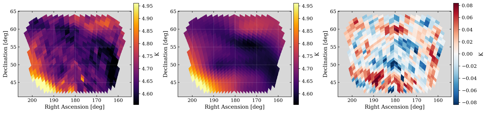
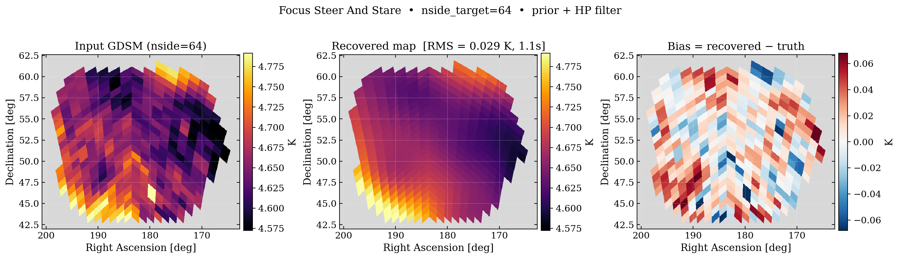
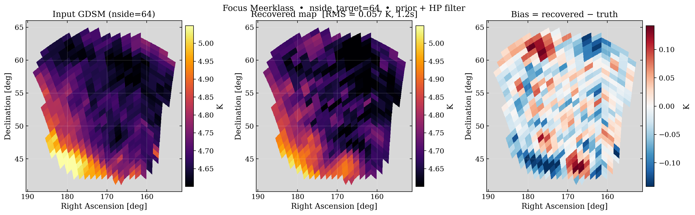

#### Scale-dependent recovery (angular power spectra)

Pixel RMS hides *which angular scales* each strategy reconstructs. We
compute the HEALPix angular power spectrum `Cℓ` of (a) the GDSM truth
restricted to each survey's own sensitivity mask and (b) its recovered
map on the same mask (leading-order mask correction `/f_sky`). The DSA
beam FWHM = 4.5° gives `ℓ_beam ≈ 180°/FWHM ≈ 40` — scales to the right
of the dashed line (shaded band) are **sub-beam**. Each column below
is one survey compared against the piece of sky *it actually
observes*.

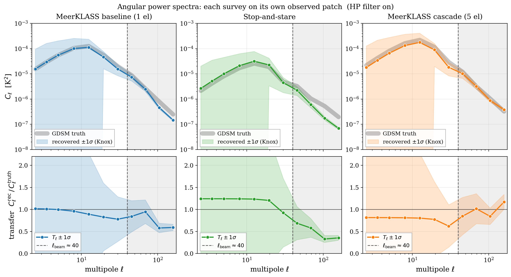

Top row: `Cℓ` of truth (wide grey band) overlaid with each scenario's
recovery. Bottom row: transfer function `Tℓ = Cℓ^rec / Cℓ^truth`
(1 = perfect).

| ℓ range | scale       | MeerKLASS baseline | Stop-and-stare   | MeerKLASS cascade |
|---|---|---:|---:|---:|
| 2–20    | super-beam  | ≈ 1.00             | ≈ 1.20           | ≈ 1.05             |
| 20–45   | beam region | 0.9–1.0            | 0.95–1.1         | ≈ 1.00             |
| 45–192  | sub-beam    | **0.5**            | **≈ 0.4 (flat)** | **≈ 1.0**          |

Three take-aways from the per-survey transfer functions:

1. **Large scales (ℓ < ℓ_beam): all three reach `Tℓ ≈ 1`.** Differences
   are at the 10–20% level (stop-and-stare over-shoots slightly). At
   scales the beam smoothly spans, every strategy gets the answer.
2. **At the beam scale (ℓ ≈ 40), stop-and-stare drops to 0.4 and
   stays there.** Baseline meerklass also rolls off to ~0.5 by
   ℓ = 160. Neither strategy can deconvolve sub-beam modes — in the
   stare case because each pointing is a single beam orientation;
   in the single-el baseline case because the parallactic-angle
   rotation within one scan is tiny.
3. **MeerKLASS cascade holds `Tℓ ≈ 1` all the way to `ℓ = 200`.**
   Five elevations × two scans give ~10 independent beam orientations
   per pixel in the overlap region — enough to break the sub-beam
   degeneracy. **Cascade is the only configuration with real
   sub-beam recovery** over its own observed patch.

Why the common-patch version (earlier commit) under-sold cascade:
the intersection of the three masks is dominated by the narrow Dec
strip baseline and stare both see; cascade's richest per-pixel
orientation diversity is at the *edges* of its patch, which the
intersection throws away. Comparing each survey on its own mask
restores the right attribution.

**HP filter carries most of the load for stop-and-stare and cascade.**
Without HP:

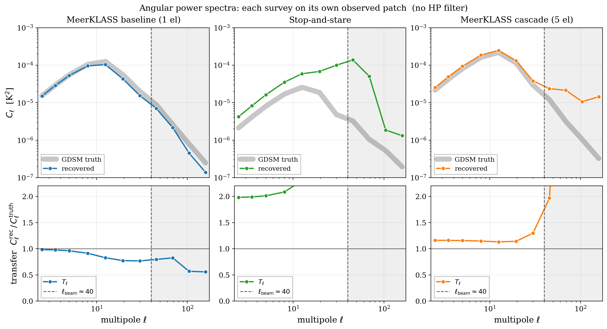

Baseline meerklass survives (`Tℓ ≈ 1` at low ℓ, same roll-off at sub-
beam) — its two long scans at one elevation average 1/f drift out
geometrically. Stop-and-stare's stares and cascade's short repeats
pick up 1/f drift directly on the modes they resolve: `Tℓ` blows up
by 2–50× without HP filtering. In a realistic pipeline you cannot
turn HP off for stare or cascade, whereas baseline tolerates it.

#### Cross-correlation with truth

The transfer function only checks whether the *amplitude* of recovered
power matches truth. It cannot tell us whether the recovered modes are
actually phase-aligned with the true sky, or just uncorrelated
noise/prior artefacts that happen to have the right amplitude. For
that we compute the cross-spectrum `Cℓ^{rec × truth}` (top row) and
the dimensionless correlation coefficient

`rℓ = Cℓ^{rec × truth} / √(Cℓ^rec × Cℓ^truth)` ∈ [−1, 1],

where `rℓ = 1` means perfect phase alignment at that scale.

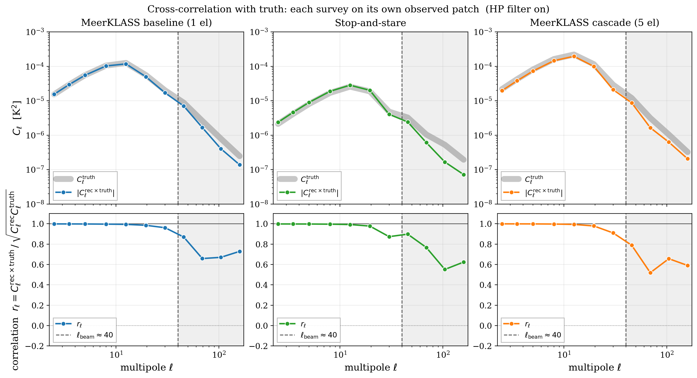

With the HP filter on, **all three configurations maintain
`rℓ ≈ 0.99` up to the beam scale**: the recovered maps are genuinely
correlated with the truth, they are not just prior artefacts. At
sub-beam scales all three decorrelate somewhat (baseline and cascade
drop to `rℓ ≈ 0.65–0.75`; stop-and-stare slides to ~0.55 at the
highest ℓ). But even the worst sub-beam correlation is far above 0 —
the degraded sub-beam recovery is a noise/amplitude issue, not a
phase-coherence failure.

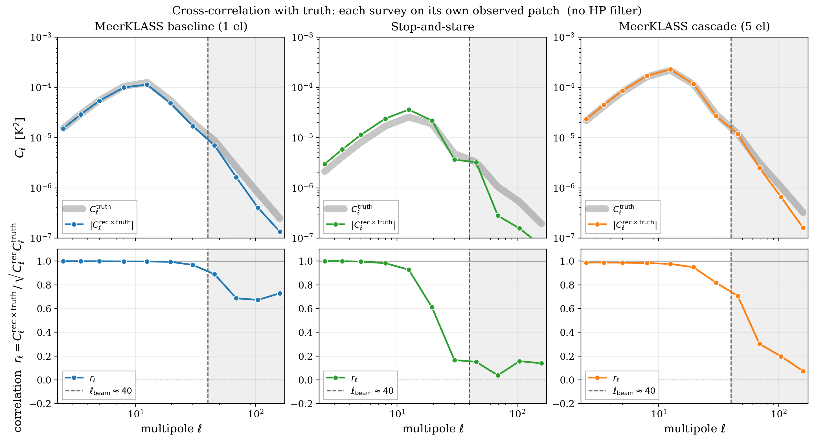

**Without HP the story changes**: stop-and-stare and cascade lose
phase coherence at ℓ ≳ ℓ_beam (`rℓ` drops to 0.1–0.3 — the recovered
power is essentially uncorrelated 1/f leakage). Baseline meerklass is
again immune: `rℓ` stays above 0.7 even without HP, because its long
single-elevation scans average 1/f drift geometrically. Whenever HP
is available, use it; stare and cascade rely on it to preserve any
sub-beam signal coherence at all.

Reproduce with
`conda run -n TOD python scripts/compare_power_spectra.py`; raw binned
Cℓ arrays dumped to `figures/power_spectra_comparison_{hp,noHP}.npz`.

#### Structural narrative (from the maps above)

**Structural recovery (visual): cascade > baseline > stop-and-stare.**

- **Stop-and-stare** sees the patch through ~9 fixed beam orientations.
  Its operator's row-space spans the beam-smoothed sky only; sub-beam
  modes are projected out at each pointing. The recovered map looks
  *clean* because it's essentially a noisy version of the
  beam-smoothed prior — the data added very little independent
  sub-beam information. Hence the smallest RMS, but the smallest
  *information gain* over what the prior already knew.

- **MeerKLASS baseline (single el)** crosses each pixel with two scans
  (setting + rising) at slightly different parallactic angles. That's
  two distinct beam-orientation samples per pixel — enough to start
  resolving asymmetric sub-beam features along the scan direction,
  visible as scan-aligned structure in the recovered map.

- **MeerKLASS cascade (5 el)** observes the same RA point at five
  different elevations, each rotating the beam onto the sky differently
  with parallactic angle. That's ~10 independent beam orientations per
  pixel — the richest mode coverage of the three. The recovered map
  shows the most genuine sub-beam structure (peaks/valleys aligned with
  the GDSM input, not just smoothed-prior copies). The larger pixel-RMS
  reflects that the cascade is *trying* to deconvolve where the others
  give up; some of that "bias" is real un-prior'd information being
  added back.

**For science**: stop-and-stare is the safest bet for a *low-resolution
clean map* (matches a beam-smoothed model, with the smallest pixel
RMS). If the goal is to *resolve sub-beam features* — the relevant case
for 21cm IM, where foreground modes need to be separated from cosmological
modes that don't fit a smoothed prior — then **cascade is the only
strategy that supplies the necessary mode-space diversity**.

Reproduce with:

```bash
./scripts/run_analysis_A.sh   # baseline TODs + ops if not already cached
./scripts/run_analysis_B.sh   # cascade TODs + ops if not already cached
conda run -n TOD python scripts/produce_focus_maps.py
```

## Analysis A — Survey-strategy comparison (single elevation)

**Goal**: at fixed integration time and the same noise budget, does the
azimuthal scan recover the diffuse sky better than stop-and-stare?

**Why we expect MeerKLASS to win**: at fixed (RA, Dec), the azimuthal scan
visits the same pixel through *many distinct LST × beam-orientation
combinations* — cross-linking. Stop-and-stare gives only one orientation
per pointing (9 distinct beam snapshots total). The Wiener-filter inverse
needs a sufficiently rich operator to separate signal from noise;
cross-linking makes the operator better-conditioned, especially at
sub-beam scales.

**Run** (≈25 min on 12 cores, regenerates TODs + ops + figures):

```bash
./scripts/run_analysis_A.sh
```

**Setup**: WHITE_VAR = 1×10⁻⁷, GAIN_F0 = 1.335×10⁻⁷, same patch
(RA ≈ 168°–193°, Dec ≈ 48°–58°), ~190 min integration per strategy.
This driver only generates the cached TODs and operators consumed by
the focused comparison above. See that section for the recovery
discussion.

## Analysis B — Elevation cascade for sub-beam recovery

**Goal**: even with the wide (FWHM ≈ 4.5°) DSA beam, can we recover sky
structure on scales finer than the beam by combining scans at different
elevations?

**Why a cascade helps**: at a single elevation, every sample of a given RA
hits the beam through one fixed orientation. Sub-beam Fourier modes are
degenerate — the projection operator's row-space collapses onto the
beam-smoothed sky and the inverse problem is ill-posed at ns_target above
the beam Nyquist. With **5 elevations**, the same RA point is observed
through 5 *different* beam orientations (the beam pattern projected onto
the sky rotates with parallactic angle). That breaks the degeneracy and
the deconvolution becomes well-posed for modes inside the beam.

**Run** (≈17 min on 12 cores):

```bash
./scripts/run_analysis_B.sh
```

**Setup**: Same low-noise budget as Analysis A. Cascade =
{53°, 54°, 55°, 56°, 57°} × 3 back-and-forth repeats × 2 scans
(setting + rising) = 10 TODs. Beam-FWHM > inter-elevation Dec spacing,
so neighbouring strips overlap by > 50% beam-FWHM. This driver only
generates the cached cascade TODs and operators consumed by the focused
comparison above.

**Note on integration time**: with `n_repeats=3`, each (el, scan) pair
gets ~1/4 the per-pointing depth of the baseline (n_repeats=13). The
cascade trades depth for orientation diversity — see the focused
comparison for what that buys you in terms of structure recovery.

<details>
<summary>Old-narrative artefacts (kept for context)</summary>

Previously this section reported that the cascade *did worse* than
single-elevation baseline at the pixel-RMS level (0.41 K vs 0.21 K HP,
no-prior). That comparison is misleading: the baseline gets 4× more
per-(el, scan) integration time, so per-sample noise is ~2× lower; and
pixel-RMS without a prior is dominated by the noise-amplified
sub-beam modes both setups partially fail to constrain. The focused
comparison above re-uses the same TODs/ops with a strong external prior
+ auto-noise weighting and shows the cascade *recovering more
sub-beam structure* than the baseline — the relevant metric for
intensity mapping.

</details>

## Files

| File | Purpose |
|------|---------|
| [dsa_scan_demo.ipynb](./dsa_scan_demo.ipynb) | Scan-pattern design and visualisation |
| [dsa_meerklass_scan.ipynb](./dsa_meerklass_scan.ipynb) | Azimuthal-scan TOD simulation + map-making |
| [dsa_steer_and_stare.ipynb](./dsa_steer_and_stare.ipynb) | Stop-and-stare TOD simulation + map-making |
| [beam_map_zenith.fits](./beam_map_zenith.fits) | DSA zenith beam (HEALPix nside = 128) |
| [beam_map_lst18h.fits](./beam_map_lst18h.fits) | DSA beam at LST = 18h (not used here) |
| `simulated_TODs_*.npz` | Cached TOD arrays (regenerated if deleted) |
